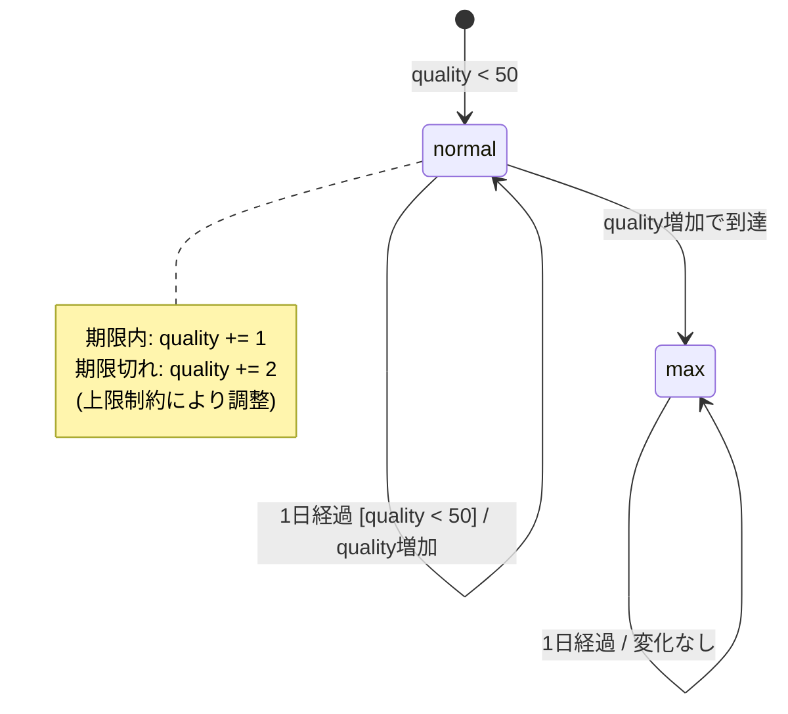

# Aged Brie - 振る舞いの形式化

**作成日**: 2025-12-30
**ベース仕様**: `docs/requirements/aged-brie/final-analysis.md`

## 概要

このドキュメントでは、Aged Brieの振る舞いを以下の形式で形式化します：
1. 状態遷移図（Qualityの状態）
2. デシジョンテーブル（条件と結果の対応）
3. 境界値分析

## SellInについて

`sellIn`は「販売期限日までの残り日数」を表します。毎日-1されます。

sellInの値による状態分類：
- **sellIn > 0**: 期限内（通常向上、+1/日）
- **sellIn <= 0**: 期限切れ（2倍速向上、+2/日）

## 1. 状態遷移図

## 2. デシジョンテーブル

| # | 条件: sellIn（更新前） | 条件: quality（更新前） | 結果: sellIn変化 | 結果: quality変化 | 備考 |
|---|---------------------|-----------------|----------------|-----------------|------|
| 1 | `> 0` | `<= 48`           | -1 | +1 | 期限内、通常向上 |
| 2 | `> 0` | = 49            | -1 | +1 | 期限内、上限到達 |
| 3 | `> 0` | = 50            | -1 | 0 | 期限内、上限維持 |
| 4 | <= 0 | `<= 48`           | -1 | +2 | 期限切れ、2倍速向上 |
| 5 | <= 0 | = 49            | -1 | +1 | 期限切れ、上限到達（+2ではない） |
| 6 | <= 0 | = 50            | -1 | 0 | 期限切れ、上限維持 |

## 3. 境界値分析

### 3.1 SellInの境界値

| 境界値 | 分類 | 振る舞い |
|-------|-----|---------|
| sellIn = 2 | 期限内（境界の1つ前） | quality +1 |
| sellIn = 1 | 期限内（境界） | quality +1、次の日が期限当日 |
| sellIn = 0 | 期限当日（期限切れ扱い） | **quality +2**（重要な境界） |
| sellIn = -1 | 期限切れ（境界の1つ後） | quality +2 |

**「期限切れ」の定義**: `sellIn < 0`（**更新後**の値）

**重要な含意**:
- sellIn = 0 の日は、更新すると sellIn = -1 になる
- よって、sellIn = 0 の日は「期限切れ扱い」になる
- 実際の期限切れ向上（quality +2）は、sellIn = 0 の日から始まる

### 3.2 Qualityの境界値

| 境界値 | 分類 | 期限内の振る舞い | 期限切れの振る舞い |
|-------|-----|----------------|------------------|
| quality = 47 | 通常 | +1 → 48 | +2 → 49 |
| quality = 48 | 上限近傍 | +1 → 49 | +2 → 50 |
| quality = 49 | 上限の1つ前 | +1 → 50 | **+1 → 50**（フェーズ1で上限到達） |
| quality = 50 | 上限 | 0（変化なし） | 0（変化なし） |

**重要**: quality = 49 で期限切れの場合、+2 ではなく **+1** になる。

**理由**:
- フェーズ1で quality < 50 の条件を満たし +1（49 → 50）
- フェーズ3で quality < 50 の条件を満たさず、追加の +1 は実行されない
- 結果として +1 のみ増加

### 3.3 同時境界（sellIn = 0, quality = 49）

| 更新前 | フェーズ1 | フェーズ2 | フェーズ3 | 更新後 |
|-------|---------|---------|---------|-------|
| sellIn=0, quality=49 | quality→50 | sellIn→-1 | スキップ（quality=50） | sellIn=-1, quality=50 |

**結論**: 両方が境界値の場合、quality は +1 のみ増加する。

## 4. テストケースへの示唆

フェーズ3でGherkin仕様書を作成する際、以下のテストケースを含めるべきです：

### 4.1 基本的な振る舞い

- [ ] 期限内の通常向上（sellIn >= 1, quality < 50）
- [ ] 期限切れの2倍速向上（sellIn < 0, quality <= 48）
- [ ] Quality上限の維持（quality = 50 で変化なし）

### 4.2 境界条件

- [ ] sellIn = 1 → 0 → -1 の遷移
- [ ] sellIn = 0 の日の向上（quality +2）
- [ ] quality = 48 → 49 → 50 の遷移（期限切れ時）
- [ ] quality = 49 で期限切れ（+1 のみ増加）

## まとめ

Aged Brieの振る舞いは以下の3つのルールで形式化できます：

1. **基本向上**: 毎日 sellIn -1、quality +1（quality < 50 の場合）
2. **期限切れ向上**: sellIn < 0（更新後）の場合、さらに quality +1
3. **上限制約**: quality は 50 を超えない

**重要な境界条件**:
- sellIn = 0 の日は期限切れ扱い
- quality = 49 で期限切れの場合、+1 のみ増加（上限で制限）

**通常アイテムとの対称性**:
- 通常アイテム: 劣化（-1/-2）、下限0
- Aged Brie: 向上（+1/+2）、上限50

この形式化をベースに、フェーズ3でGherkin仕様書を作成します。
