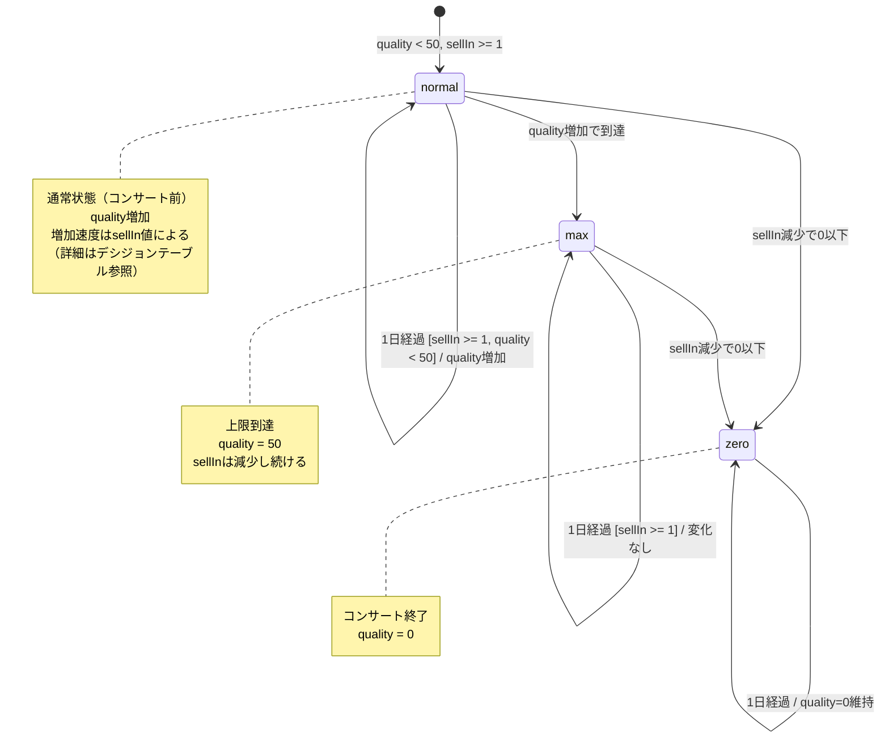

# Backstage passes to a TAFKAL80ETC concert - 振る舞いの形式化

**作成日**: 2025-12-30
**ベース仕様**: `docs/requirements/backstage-passes/final-analysis.md`

## 概要

このドキュメントでは、Backstage passesの振る舞いを以下の形式で形式化します：
1. 状態遷移図（sellInによる状態の変化）
2. デシジョンテーブル（条件と結果の対応）
3. 境界値分析

Backstage passesは、コンサートまでの残り日数によってQuality増加速度が変わり、コンサート終了後は価値がなくなるという特徴があります。

## SellInについて

`sellIn`は「コンサート開催日までの残り日数」を表します。毎日-1されます。

sellInの値による状態分類：
- **sellIn >= 11**: 11日以上前（通常増加、+1/日）
- **6 <= sellIn <= 10**: 10日以内（2倍速増加、+2/日）
- **1 <= sellIn <= 5**: 5日以内（3倍速増加、+3/日）
- **sellIn <= 0**: コンサート終了（quality = 0）

## 1. 状態遷移図

**解説**:
- 3つの主要な状態: normal（通常）、max（上限到達）、zero（コンサート終了）
- 具体的な増加速度（+1/+2/+3）はデシジョンテーブルで定義
- コンサート終了（sellIn <= 0）で即座にquality = 0になる

## 2. デシジョンテーブル

| # | 条件: sellIn（更新前） | 条件: quality（更新前） | 結果: sellIn変化 | 結果: quality変化 | 備考 |
|---|---------------------|-----------------|----------------|-----------------|------|
| 1 | `>= 11` | < 49 | -1 | +1 | 11日以上前、通常増加 |
| 2 | `>= 11` | = 49 | -1 | +1 | 11日以上前、上限到達 |
| 3 | `>= 11` | = 50 | -1 | 0 | 11日以上前、上限維持 |
| 4 | 6-10 | <= 48 | -1 | +2 | 10日以内、2倍速増加 |
| 5 | 6-10 | = 49 | -1 | +1 | 10日以内、上限到達（+2ではない） |
| 6 | 6-10 | = 50 | -1 | 0 | 10日以内、上限維持 |
| 7 | 1-5 | <= 47 | -1 | +3 | 5日以内、3倍速増加 |
| 8 | 1-5 | = 48 | -1 | +2 | 5日以内、上限到達（+3ではない） |
| 9 | 1-5 | = 49 | -1 | +1 | 5日以内、上限到達（+3でも+2でもない） |
| 10 | 1-5 | = 50 | -1 | 0 | 5日以内、上限維持 |
| 11 | `<= 0` | 任意 | -1 | quality = 0 | コンサート終了 |

**重要**: quality上限チェックは各増加ステップで行われるため、+2や+3の増加でも50を超えない。

## 3. 境界値分析

### 3.1 SellInの境界値

| 境界値 | 分類 | 振る舞い |
|-------|-----|---------|
| sellIn = 12 | 11日以上前（境界の1つ前） | quality +1 |
| sellIn = 11 | 11日以上前（境界） | quality +1、次の日が10日以内 |
| sellIn = 10 | 10日以内（境界） | **quality +2**（重要な境界） |
| sellIn = 7 | 10日以内（中間） | quality +2 |
| sellIn = 6 | 10日以内（境界の1つ前） | quality +2、次の日が5日以内 |
| sellIn = 5 | 5日以内（境界） | **quality +3**（重要な境界） |
| sellIn = 3 | 5日以内（中間） | quality +3 |
| sellIn = 1 | 5日以内（境界の1つ前） | quality +3、次の日が当日 |
| sellIn = 0 | コンサート当日（終了扱い） | **quality = 0**（重要な境界） |
| sellIn = -1 | コンサート終了後（境界の1つ後） | quality = 0 |

**「コンサート終了」の定義**: `sellIn < 0`（**更新後**の値）

**重要な含意**:
- sellIn = 0 の日は、更新すると sellIn = -1 になる
- よって、sellIn = 0 の日は「コンサート終了扱い」になる
- 実際のquality = 0は、sellIn = 0 の日から始まる

### 3.2 Qualityの境界値

#### 11日以上前の場合

| 境界値 | 分類 | 振る舞い |
|-------|-----|---------|
| quality = 48 | 通常 | +1 → 49 |
| quality = 49 | 上限の1つ前 | +1 → 50 |
| quality = 50 | 上限 | 0（変化なし） |

#### 10日以内（6 <= sellIn <= 10）の場合

| 境界値 | 分類 | 振る舞い |
|-------|-----|---------|
| quality = 47 | 通常 | +2 → 49 |
| quality = 48 | 上限近傍 | +2 → 50 |
| quality = 49 | 上限の1つ前 | +1 → 50 |
| quality = 50 | 上限 | 0（変化なし） |

#### 5日以内（1 <= sellIn <= 5）の場合

| 境界値 | 分類 | 振る舞い |
|-------|-----|---------|
| quality = 46 | 通常 | +3 → 49 |
| quality = 47 | 上限近傍 | +3 → 50 |
| quality = 48 | 上限近傍 | +2 → 50 |
| quality = 49 | 上限の1つ前 | +1 → 50 |
| quality = 50 | 上限 | 0（変化なし） |

## 4. テストケースへの示唆

フェーズ3でGherkin仕様書を作成する際、以下のテストケースを含めるべきです：

### 4.1 基本的な振る舞い

- [ ] 11日以上前の通常増加（sellIn >= 11, quality < 50）
- [ ] 10日以内の2倍速増加（6 <= sellIn <= 10, quality <= 48）
- [ ] 5日以内の3倍速増加（1 <= sellIn <= 5, quality <= 47）
- [ ] コンサート終了後のquality = 0（sellIn <= 0）
- [ ] Quality上限の維持（quality = 50 で変化なし）

### 4.2 境界条件

- [ ] sellIn = 11 → 10 の遷移（+1から+2への変化）
- [ ] sellIn = 6 → 5 の遷移（+2から+3への変化）
- [ ] sellIn = 1 → 0 の遷移（+3からquality = 0への変化）
- [ ] sellIn = 0 の日の処理（コンサート終了扱い）
- [ ] quality = 49 で10日以内（+1 のみ増加）
- [ ] quality = 48 で5日以内（+2 のみ増加）
- [ ] quality = 49 で5日以内（+1 のみ増加）

### 4.3 エッジケース

- [ ] sellIn = 0, quality = 50 の処理（上限でも0になる）
- [ ] 連続した日数経過での状態遷移（11日以上→10日以内→5日以内→終了）
- [ ] 上限到達後の状態遷移（quality = 50 のまま sellIn が減少）

## まとめ

Backstage passesの振る舞いは以下の5つのルールで形式化できます：

1. **基本増加**: 毎日 sellIn -1、quality +1（quality < 50、sellIn >= 1 の場合）
2. **10日以内ボーナス**: sellIn <= 10 の場合、さらに quality +1（quality < 50 の場合）
3. **5日以内ボーナス**: sellIn <= 5 の場合、さらに quality +1（quality < 50 の場合）
4. **コンサート終了**: sellIn <= 0（更新後）の場合、quality = 0
5. **上限制約**: quality は 50 を超えない

**重要な境界条件**:
- sellIn = 11, 6, 1 で増加速度が変わる
- sellIn = 0 の日はコンサート終了扱い
- quality = 49 で10日以内の場合、+1 のみ増加
- quality = 48 で5日以内の場合、+2 のみ増加
- quality = 49 で5日以内の場合、+1 のみ増加

**他のアイテムとの違い**:
- 通常アイテム: 劣化（-1/-2）、下限0
- Aged Brie: 向上（+1/+2）、上限50
- Backstage passes: **段階的向上（+1/+2/+3） + 終了後ゼロ化**、上限50

この形式化をベースに、フェーズ3でGherkin仕様書を作成します。
