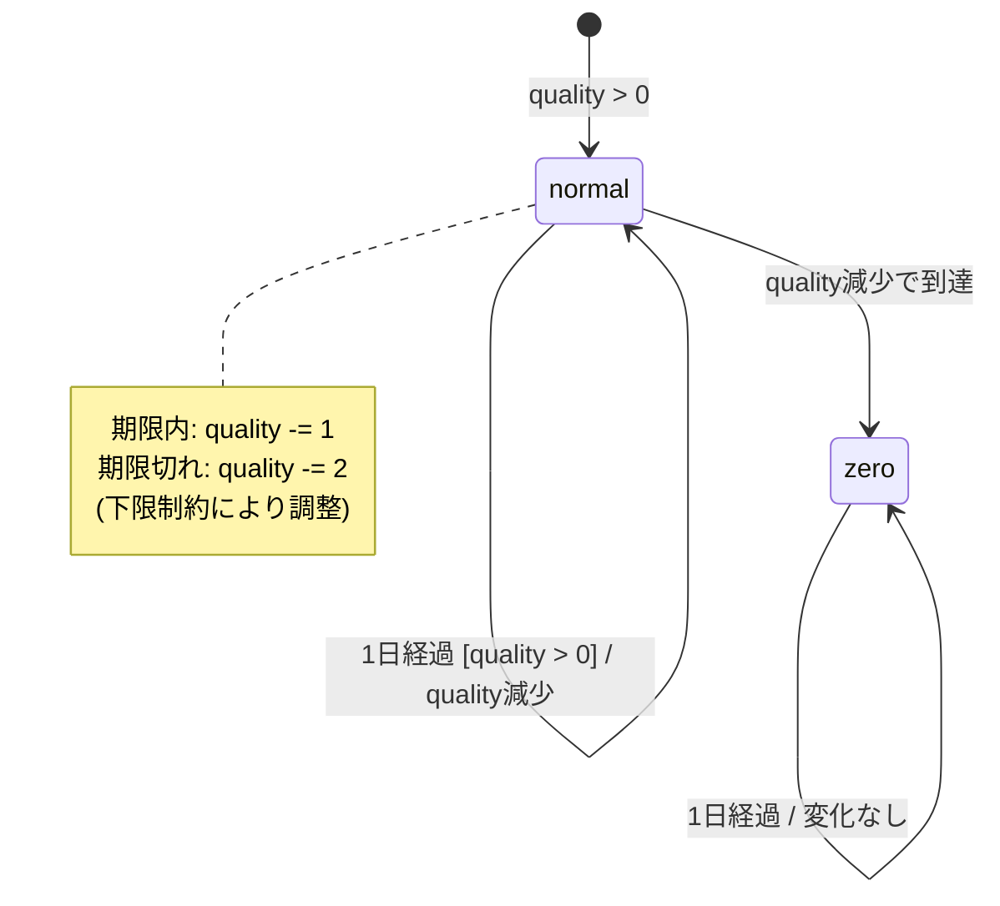

# 通常アイテム - 振る舞いの形式化

**作成日**: 2025-12-29
**ベース仕様**: `docs/requirements/normal-item/final-analysis.md`

## 概要

このドキュメントでは、通常アイテムの振る舞いを以下の形式で形式化します：
1. 状態遷移図（Qualityの状態）
2. デシジョンテーブル（条件と結果の対応）
3. 境界値分析

## SellInについて

requirementsで言及された`sellIn`は「販売期限日までの残り日数」を表します。毎日-1されます。

sellInの値による状態分類：
- **sellIn >= 1**: 期限まで残り日数あり（通常劣化）
- **sellIn = 0**: 期限当日（実装上は期限切れ扱い）
- **sellIn < 0**: 期限切れ（期限を過ぎた日数）

## 1. 状態遷移図

## 2. デシジョンテーブル

| # | 条件: sellIn（更新前） | 条件: quality（更新前） | 結果: sellIn変化 | 結果: quality変化 | 備考 |
|---|---------------------|-----------------|----------------|-----------------|------|
| 1 | `> 0` | `>= 2`            | -1 | -1 | 期限内、通常劣化 |
| 2 | `> 0` | = 1             | -1 | -1 | 期限内、下限到達 |
| 3 | `> 0` | = 0             | -1 | 0 | 期限内、下限維持 |
| 4 | <= 0 | `>= 2`            | -1 | -2 | 期限切れ、2倍速劣化 |
| 5 | <= 0 | = 1             | -1 | -1 | 期限切れ、下限到達（-2ではない） |
| 6 | <= 0 | = 0             | -1 | 0 | 期限切れ、下限維持 |

## 3. 境界値分析

### 3.1 SellInの境界値

| 境界値 | 分類 | 振る舞い |
|-------|-----|---------|
| sellIn = 2 | 期限内（境界の1つ前） | quality -1 |
| sellIn = 1 | 期限内（境界） | quality -1、次の日が期限当日 |
| sellIn = 0 | 期限当日（期限切れ扱い） | **quality -2**（重要な境界） |
| sellIn = -1 | 期限切れ（境界の1つ後） | quality -2 |

**「期限切れ」の定義**: `sellIn < 0`（**更新後**の値）

**重要な含意**:
- sellIn = 0 の日は、更新すると sellIn = -1 になる
- よって、sellIn = 0 の日は「期限切れ扱い」になる
- 実際の期限切れ劣化（quality -2）は、sellIn = 0 の日から始まる

### 3.2 Qualityの境界値

| 境界値 | 分類 | 期限内の振る舞い | 期限切れの振る舞い |
|-------|-----|----------------|------------------|
| quality = 3 | 通常 | -1 → 2 | -2 → 1 |
| quality = 2 | 下限近傍 | -1 → 1 | -2 → 0 |
| quality = 1 | 下限の1つ前 | -1 → 0 | **-1 → 0**（フェーズ1で下限到達） |
| quality = 0 | 下限 | 0（変化なし） | 0（変化なし） |

**重要**: quality = 1 で期限切れの場合、-2 ではなく **-1** になる。

### 3.3 同時境界（sellIn = 0, quality = 1）

| 更新前 | フェーズ1 | フェーズ2 | フェーズ3 | 更新後 |
|-------|---------|---------|---------|-------|
| sellIn=0, quality=1 | quality→0 | sellIn→-1 | スキップ（quality=0） | sellIn=-1, quality=0 |

**結論**: 両方が境界値の場合、quality は -1 のみ減少する。

## 4. テストケースへの示唆

フェーズ3でGherkin仕様書を作成する際、以下のテストケースを含めるべきです：

### 4.1 基本的な振る舞い

- [ ] 期限内の通常劣化（sellIn >= 1, quality > 0）
- [ ] 期限切れの2倍速劣化（sellIn < 0, quality > 1）
- [ ] Quality下限の維持（quality = 0 で変化なし）

### 4.2 境界条件

- [ ] sellIn = 1 → 0 → -1 の遷移
- [ ] sellIn = 0 の日の劣化（quality -2）
- [ ] quality = 2 → 1 → 0 の遷移（期限切れ時）
- [ ] quality = 1 で期限切れ（-1 のみ減少）

## まとめ

通常アイテムの振る舞いは以下の3つのルールで形式化できます：

1. **基本劣化**: 毎日 sellIn -1、quality -1（quality > 0 の場合）
2. **期限切れ劣化**: sellIn < 0（更新後）の場合、さらに quality -1
3. **下限制約**: quality は 0 未満にならない

**重要な境界条件**:
- sellIn = 0 の日は期限切れ扱い
- quality = 1 で期限切れの場合、-1 のみ減少

この形式化をベースに、フェーズ3でGherkin仕様書を作成します。
