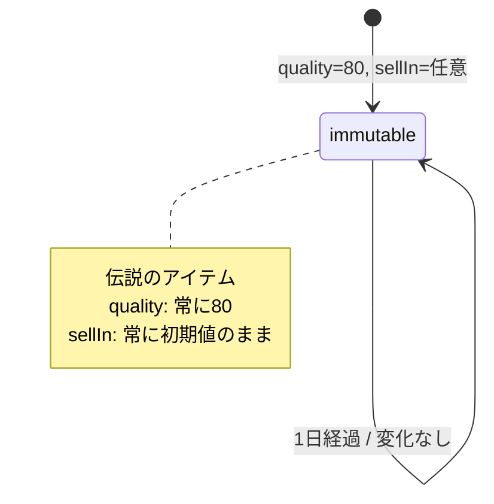

# Sulfuras - 振る舞いの形式化

**作成日**: 2025-12-30
**ベース仕様**: `docs/requirements/sulfuras/final-analysis.md`

## 概要

このドキュメントでは、Sulfurasの振る舞いを以下の形式で形式化します：
1. 状態遷移図（不変状態の表現）
2. デシジョンテーブル（条件と結果の対応）
3. 境界値分析

Sulfurasは他のアイテムと根本的に異なり、**状態遷移がない（不変）**という特徴があります。

## SellInとQualityについて

### Quality
- **固定値**: 80（前提条件）
- **変化**: なし

### SellIn
- **初期値**: 任意
- **変化**: なし

## 1. 状態遷移図



**解説**: Sulfurasには状態遷移がない。どれだけ日数が経過しても、同じ不変状態を維持する。

## 2. デシジョンテーブル

| # | 条件: アイテム名 | 条件: sellIn（更新前） | 条件: quality（更新前） | 結果: sellIn変化 | 結果: quality変化 | 備考 |
|---|---------------|---------------------|-----------------|----------------|-----------------|------|
| 1 | "Sulfuras, Hand of Ragnaros" | 任意 | 80 | 0 | 0 | 変化なし |

**注**:
- アイテム名は完全一致で判定される
- sellInとqualityの値に関わらず、変化なし
- 品質80は前提条件（80以外での作成は想定外）

## 3. 境界値分析

### 3.1 SellInの境界値

| 境界値 | 分類 | 振る舞い |
|-------|-----|---------|
| sellIn > 0 | 期限内 | 変化なし |
| sellIn = 0 | 期限当日 | 変化なし |
| sellIn < 0 | 期限切れ | 変化なし |

**重要**: Sulfurasは販売期限の影響を受けない。sellInの値がどうであれ、変化しない。

### 3.2 Qualityの境界値

| 境界値 | 分類 | 振る舞い |
|-------|-----|---------|
| quality = 80 | 標準（前提条件） | 変化なし |

**注**: 品質80のみをテスト対象とする。80以外での作成は未定義。

### 3.3 例外的な扱い

Sulfurasは以下の共通ルールの**例外**として扱われる：

1. **品質の上限（50）の例外**:
   - 共通ルール: 「Quality値は50以上にはなりません」
   - Sulfuras: 品質80を許容（伝説のアイテムとしての特別扱い）

2. **sellInの減少の例外**:
   - 共通ルール: 「毎日の終わりには、両方の項目の値を1小さくします」
   - Sulfuras: sellInを減らさない（販売されない）

3. **品質の劣化の例外**:
   - 共通ルール: 通常アイテムは品質が劣化する
   - Sulfuras: 品質が変化しない

## 4. テストケースへの示唆

フェーズ3でGherkin仕様書を作成する際、以下のテストケースを含めるべきです：

### 4.1 基本的な振る舞い

- [ ] 1日経過しても変化なし（quality=80, sellIn=任意値のまま）
- [ ] 複数日経過しても変化なし

### 4.2 境界条件

- [ ] sellIn > 0 で変化なし
- [ ] sellIn = 0 で変化なし
- [ ] sellIn < 0 で変化なし

### 4.3 例外ケース

- [ ] 品質80（50を超える）が許容される
- [ ] 他のアイテムと同じ配列で処理しても影響を受けない

## 5. 実装における除外処理

Sulfurasは、updateQualityメソッド内で以下の処理から除外されています：

### 5.1 品質劣化処理からの除外

**コード箇所**: GildedRose.java:15-17
```java
if (!items[i].name.equals("Sulfuras, Hand of Ragnaros")) {
    items[i].quality = items[i].quality - 1;
}
```

### 5.2 sellIn減少処理からの除外

**コード箇所**: GildedRose.java:39-41
```java
if (!items[i].name.equals("Sulfuras, Hand of Ragnaros")) {
    items[i].sellIn = items[i].sellIn - 1;
}
```

### 5.3 期限切れ後の追加劣化処理からの除外

**コード箇所**: GildedRose.java:47-49
```java
if (!items[i].name.equals("Sulfuras, Hand of Ragnaros")) {
    items[i].quality = items[i].quality - 1;
}
```

## まとめ

Sulfurasの振る舞いは以下の1つのルールで形式化できます：

1. **完全な不変性**: quality、sellInともに変化しない

**重要な特徴**:
- 状態遷移なし（常に同じ状態）
- 販売期限の概念が適用されない
- 品質50の上限の例外（品質80を許容）

**テスト方針**:
- 「変化しないこと」を確認する
- 品質80での作成を前提とする
- sellInの値に関わらず不変であることを確認

**他のアイテムとの違い**:
- 通常アイテム: 劣化（-1/-2）、下限0
- Aged Brie: 向上（+1/+2）、上限50
- Sulfuras: **不変（0）**、品質80固定

この形式化をベースに、フェーズ3でGherkin仕様書を作成します。
